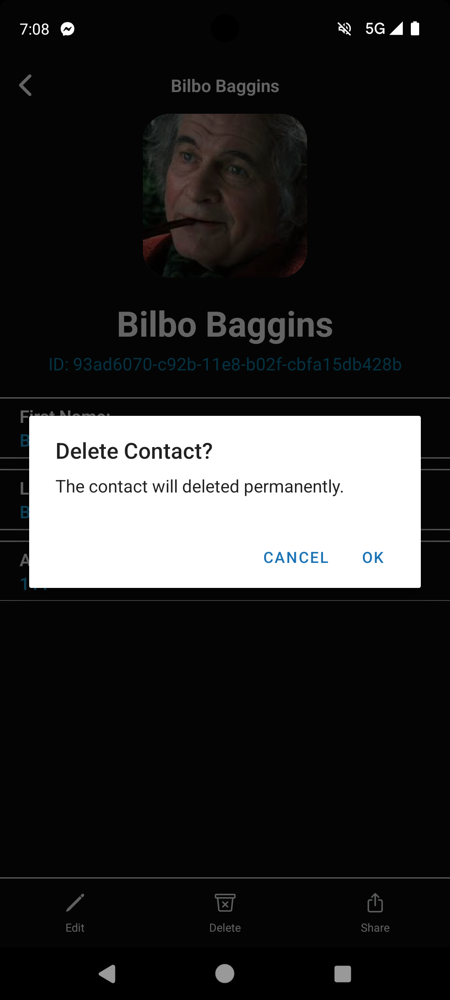

# React Native Contact App

## What we use: 

1. Expo

2. Expo Router

3. RTK Query (Redux Toolkit)

## Screenshots
| Light   |      Dark |
|----------|:-------------:|
 |  |
 |  |
 |  |
 |  |
 |  |

## Repo React: 

[https://github.com/silogos/ReactNative-HackerNewsAPI](https://github.com/silogos/React-Native-Contact-App)

## Contact API:

[https://contact.herokuapp.com/documentation#/](https://contact.herokuapp.com/documentation#/)

## Running the project

Assuming you have all the requirements installed, you can setup and run the project by running:

- clone this repository
- `yarn install` to install the dependencies
- run the following steps for your platform
- `yarn {start/android/ios/web}`